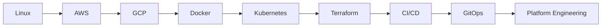

<div align="center">

<div align="center">

<a href="https://www.linkedin.com/in/hemanth-bukkuru-109299354/">

</a>

<a href="mailto:hemanthbukkuru@gmail.com">

</a>

</div>

---

# ⚡ Engineering Mindset

<div align="center">

```text
Learn Deeply.
Build Consistently.
Automate Everything.
```

</div>

---

# 🚀 Current Journey



---

# 💡 Profile Views

<div align="center">


</div>

---

<div align="center">

### ☁️ Building Cloud Infrastructure One Commit at a Time

</div>
