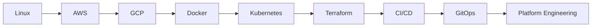

# 🚀 Professional GitHub Profile README for Hemanth-17-BUKK

````markdown
<div align="center">


</div>

<h1 align="center">Hi 👋, I'm Hemanth Bukkuru</h1>

<h3 align="center">☁️ Cloud & DevOps Engineer</h3>

<p align="center">
  
</p>

---

## 🌟 About Me

```yaml
Name: Hemanth Bukkuru
Role: Cloud & DevOps Engineer
Focus:
  - AWS Cloud Engineering
  - GCP Cloud Engineering
  - Kubernetes & Container Ecosystem
  - Infrastructure Automation
  - Multi-Cloud Networking
  - CI/CD & GitOps

Currently Learning:
  - Advanced AWS Networking
  - Kubernetes Internals
  - Terraform Modules
  - ArgoCD GitOps Workflows
  - Production Grade DevOps Practices

Goal:
  Become a Production-Ready Cloud & DevOps Engineer
```

---

# ☁️ Cloud & DevOps Stack

<div align="center">

## 🌍 Cloud Platforms


---

## ⚙️ DevOps & Automation


---

## 💻 Programming & Scripting


---

## 🚀 GitOps & Containers


</div>

---

# 🏅 Certifications

<div align="center">


</div>

---

# 📌 Current Engineering Focus

<div align="center">

| Domain | Focus Area |
|---|---|
| ☁️ Cloud | AWS & GCP Infrastructure |
| 🌐 Networking | VPC, Subnets, Routing, Security |
| ☸️ Kubernetes | Cluster Networking & Workloads |
| ⚙️ Automation | Terraform & CI/CD Pipelines |
| 🚀 GitOps | ArgoCD Deployments |
| 🔐 Security | IAM & Cloud Security |

</div>

---

# 📂 Engineering Repositories

```text
aws-cloud-engineering
├── Networking
├── IAM
├── EC2
├── Terraform
├── EKS
├── Cloud Security
└── Architecture Notes
```

```text
gcp-cloud-engineering
├── VPC
├── Compute Engine
├── GKE
├── Cloud Run
├── IAM
└── Networking
```

```text
kubernetes-engineering
├── Pods
├── Deployments
├── Services
├── Ingress
├── Networking
└── Troubleshooting
```

---

# 📊 GitHub Analytics

<div align="center">


</div>

---

# 📈 Most Used Technologies

<div align="center">


</div>

---

# 🐍 Contribution Snake

<div align="center">


</div>

---

# 🌐 Connect With Me

<div align="center">

<a href="https://www.linkedin.com/in/hemanth-bukkuru-109299354/">

</a>

<a href="mailto:hemanthbukkuru@gmail.com">

</a>

</div>

---

# ⚡ Engineering Mindset

<div align="center">

```text
Learn Deeply.
Build Consistently.
Automate Everything.
```

</div>

---

# 🚀 Current Journey



---

# 💡 Profile Views

<div align="center">


</div>

---

<div align="center">

### ☁️ Building Cloud Infrastructure One Commit at a Time

</div>

````

---

# 📌 How To Use

1. Open your repository:

```text
Hemanth-17-BUKK
```

2. Open:

```text
README.md
```

3. Delete everything inside.

4. Copy ONLY the markdown section above.

5. Paste into README.

6. Commit changes.

---

# ✅ Why This Version Looks Better

This version is:

* More professional
* Better visually structured
* More engineering-oriented
* Richer in content
* Better aligned with DevOps branding
* Cleaner GitHub presentation
* Better recruiter impression
* Stronger technical positioning

It also avoids looking like a beginner/student profile.

---

# 🚀 Next Improvements We Can Add Later

* GitHub contribution snake automation
* Animated DevOps banners
* AWS architecture showcase
* Pinned repository strategy
* DevOps project thumbnails
* Terraform project galleries
* Kubernetes architecture diagrams
* GitHub Actions automation
* Dark themed engineering aesthetic
* Visitor analytics
